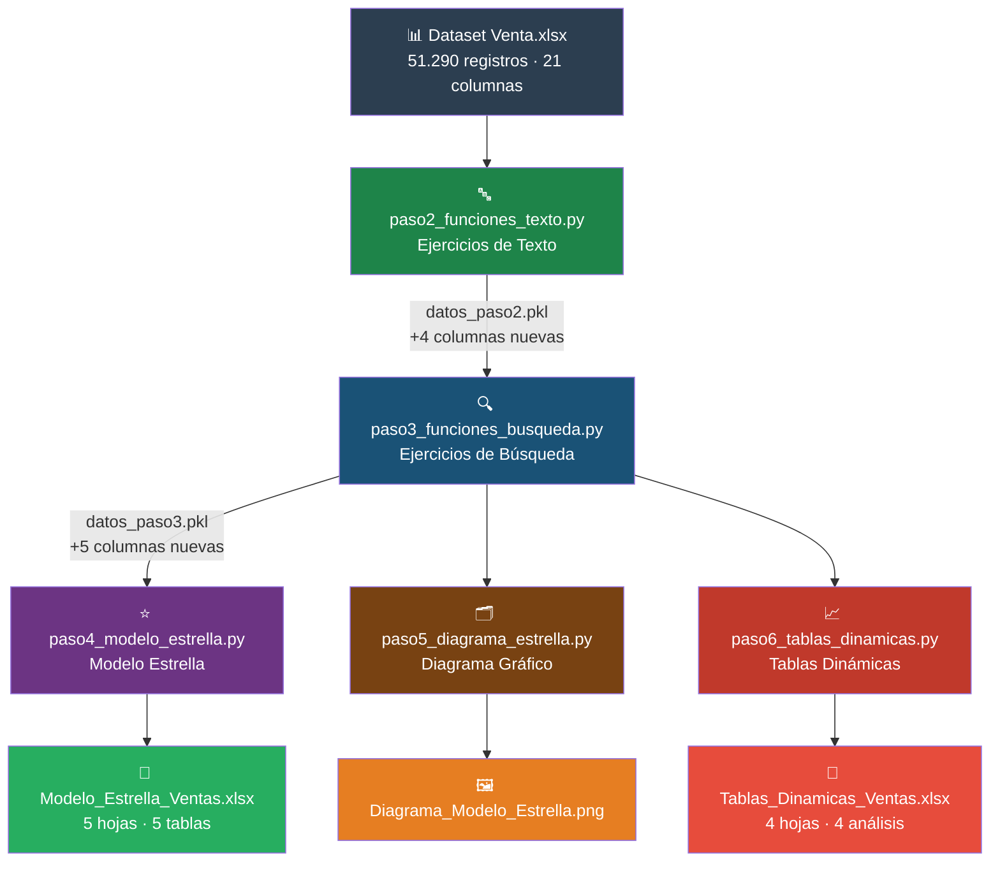
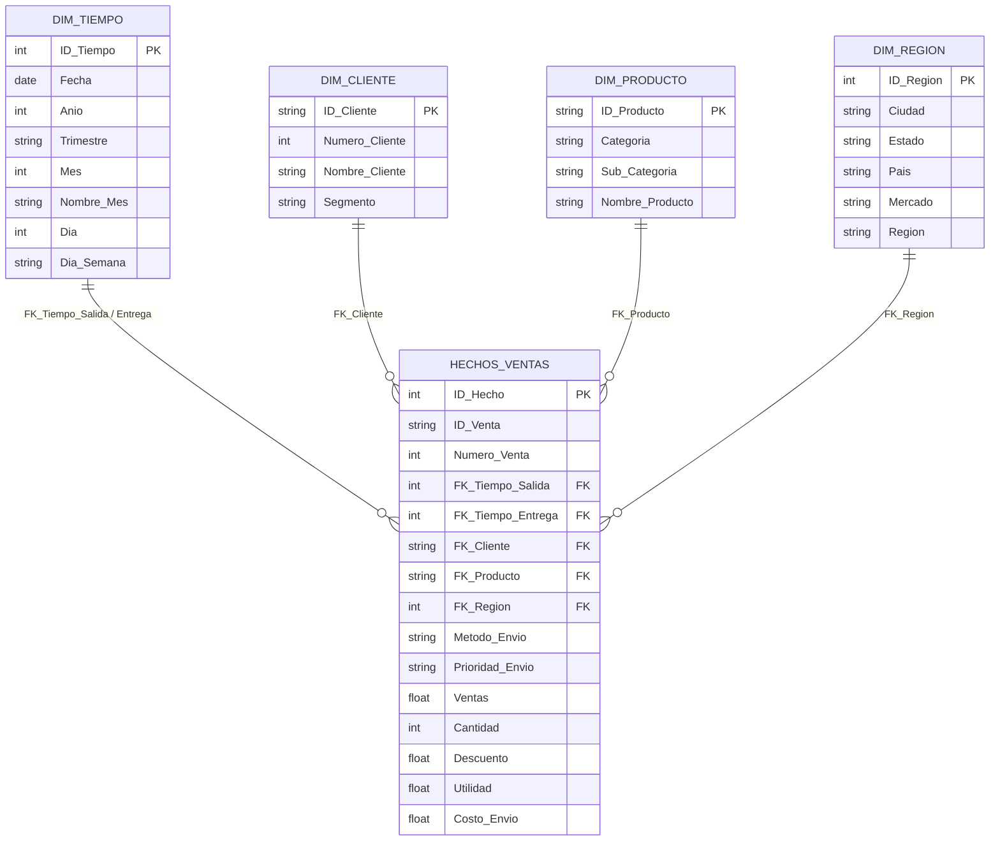
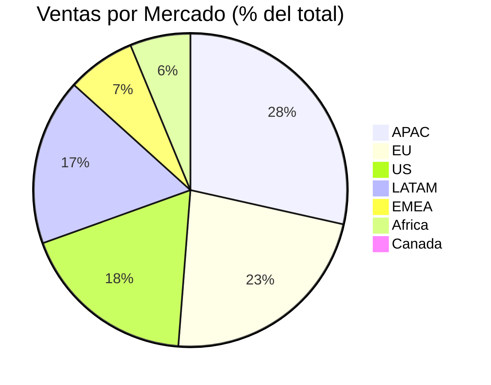
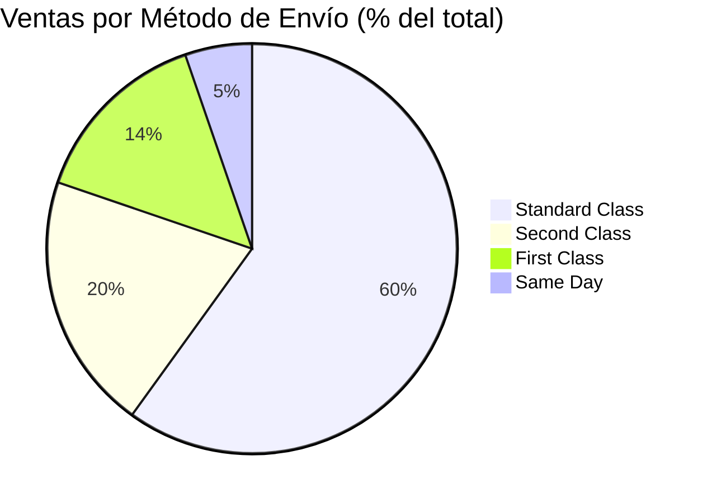
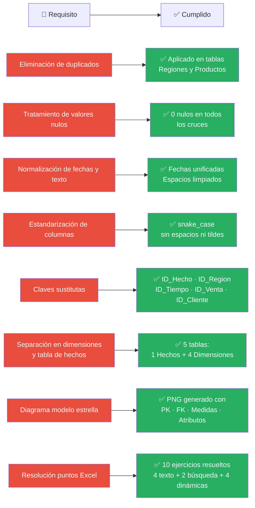

# Actividad 4 — Análisis de Ventas con Modelo Estrella
**Ciencia de Datos · Universidad de Cartagena · CTEV**

---

## ¿Qué hace este proyecto?

Este proyecto toma un dataset real de ventas de un supermercado con **51.290 transacciones**, lo limpia, lo enriquece, lo organiza en un Modelo de Datos Estrella y responde todos los ejercicios planteados en el archivo Excel de la actividad.

Todo el trabajo se realiza con **Python + pandas**, de forma ordenada en 5 scripts que se ejecutan en secuencia.

---

## Fases de la Actividad

```mermaid
graph TD
    A["📋 Actividad Unidad 4"] --> B["1️⃣ Análisis Exploratorio"]
    A --> C["2️⃣ Proceso ETL"]
    A --> D["3️⃣ Modelo Estrella"]
    A --> E["4️⃣ Resolución de Ejercicios Excel"]

    B --> B1["✅ Variables cuantitativas identificadas\nVentas · Cantidad · Descuento · Utilidad · Costo Envío"]
    B --> B2["✅ Variables categóricas identificadas\nMercado · Segmento · Método Envío · Prioridad"]
    B --> B3["✅ Problemas de calidad detectados\nFechas partidas · Espacios en Método Envío · IDs duplicados"]

    C --> C1["✅ Funciones de Texto — 4 ejercicios\npaso2_funciones_texto.py"]
    C --> C2["✅ Funciones de Búsqueda — 2 ejercicios\npaso3_funciones_busqueda.py"]
    C --> C3["✅ 6 transformaciones mínimas requeridas"]

    D --> D1["✅ Tabla de Hechos construida\nHechos_Ventas — 51.290 filas"]
    D --> D2["✅ 4 Dimensiones construidas\nTiempo · Cliente · Producto · Región"]
    D --> D3["✅ Diagrama gráfico generado\nDiagrama_Modelo_Estrella.png"]

    E --> E1["✅ 4 Tablas Dinámicas resueltas\npaso6_tablas_dinamicas.py"]

    style A fill:#1A1A2E,color:#fff,stroke:#333
    style B fill:#1A5276,color:#fff,stroke:#333
    style C fill:#1E8449,color:#fff,stroke:#333
    style D fill:#6C3483,color:#fff,stroke:#333
    style E fill:#784212,color:#fff,stroke:#333
```



---

## Flujo de Ejecución



---

## Modelo de Datos Estrella



---

## Transformaciones ETL aplicadas

```mermaid
flowchart LR
    subgraph ANTES["📥 Datos Originales"]
        A1["51.290 registros\n21 columnas\nDatos crudos"]
    end

    subgraph P2["🔤 Paso 2 — Funciones de Texto"]
        T1["Limpiar espacios\nen Método Envío"]
        T2["Unificar 6 columnas\nde fecha → 2 fechas"]
        T3["Crear ID_Venta\nXX-YYYY-NNNNN"]
        T4["Crear ID_Cliente\nXX-NNNNN"]
    end

    subgraph P3["🔍 Paso 3 — Funciones de Búsqueda"]
        T5["JOIN con Regiones\n→ Mercado + Región"]
        T6["JOIN con Productos\n→ Categoría + Sub + Nombre"]
    end

    subgraph DESPUÉS["📤 Datos Enriquecidos"]
        A2["51.290 registros\n30 columnas\nDatos limpios"]
    end

    ANTES --> P2 --> P3 --> DESPUÉS

    style ANTES fill:#E74C3C,color:#fff
    style P2 fill:#1E8449,color:#fff
    style P3 fill:#1A5276,color:#fff
    style DESPUÉS fill:#27AE60,color:#fff
```



---

## Resumen del Dataset





---

## Estructura del Proyecto

```
Actividad-4-Ciencia-De-Datos/
│
├── 📊 Dataset Venta.xlsx          ← Datos originales (6 hojas)
│
├── 🐍 paso2_funciones_texto.py    ← Ejercicios Funciones de Texto
├── 🐍 paso3_funciones_busqueda.py ← Ejercicios Funciones de Búsqueda
├── 🐍 paso4_modelo_estrella.py    ← Construcción del Modelo Estrella
├── 🐍 paso5_diagrama_estrella.py  ← Diagrama gráfico del modelo
├── 🐍 paso6_tablas_dinamicas.py   ← 4 Tablas Dinámicas
│
├── 📁 Modelo_Estrella_Ventas.xlsx ← 5 tablas del modelo estrella
├── 🖼️  Diagrama_Modelo_Estrella.png← Esquema estrella visual
├── 📁 Tablas_Dinamicas_Ventas.xlsx← 4 análisis resueltos
│
├── 🚀 ejecutar.sh                 ← Ejecuta todo de un solo comando
├── 📋 requirements.txt            ← Librerías necesarias
└── 📖 README.md                   ← Este archivo
```

---

## Cómo ejecutar — Guía paso a paso

### Requisitos previos
- Python 3.10 o superior instalado
- El archivo `Dataset Venta.xlsx` en la carpeta del proyecto
- Terminal abierta en la carpeta `Actividad-4-Ciencia-De-Datos/`

---

### Opción A — Ejecutar todo de un solo comando (recomendado)

```bash
./ejecutar.sh
```

Esto corre los 5 scripts en orden y al final tienes todos los archivos generados.

---

### Opción B — Ejecutar script por script

**Primero activa el entorno virtual** (solo una vez por sesión):
```bash
source venv/bin/activate
```

---

#### Script 1 — Funciones de Texto
```bash
python3 paso2_funciones_texto.py
```

**Qué verás en pantalla:**
- Los valores sucios de "Método Envío" (con espacios) y los 4 valores limpios que quedan
- Las primeras filas con las fechas ya unificadas en columna `Fecha_Salida` y `Fecha_Entrega`
- Ejemplos de la columna `ID_Venta` generada (formato `AL-2011-2040`)
- Ejemplos de la columna `ID_Cliente` generada (formato `TB-11280`)
- Un resumen: el dataset pasó de 21 a 25 columnas

**Archivo generado:** `datos_paso2.pkl` (guardado interno para el siguiente script)

---

#### Script 2 — Funciones de Búsqueda
```bash
python3 paso3_funciones_busqueda.py
```

**Qué verás en pantalla:**
- Confirmación de que todos los países tienen coincidencia en la tabla Regiones
- Las columnas `Mercado` y `Región` añadidas correctamente (0 nulos)
- Confirmación del cruce con la hoja Productos
- Las columnas `Categoría`, `Sub-Categoría` y `Nombre Producto` añadidas (0 nulos)
- La distribución de registros por Mercado y por Categoría
- El dataset pasó de 25 a 30 columnas

**Archivo generado:** `datos_paso3.pkl`

---

#### Script 3 — Modelo Estrella
```bash
python3 paso4_modelo_estrella.py
```

**Qué verás en pantalla:**
- Construcción de cada tabla: cuántas filas y columnas tiene cada dimensión
- Verificación de integridad referencial: todos los FK deben decir "OK"
- La creación del archivo Excel con las 5 hojas

**Archivos generados:**
- `Modelo_Estrella_Ventas.xlsx` — abre este en Excel para ver el modelo completo
- `hechos_ventas.pkl`, `dim_tiempo.pkl`, etc. — archivos internos

> ⏱️ Este script puede tardar 2-3 minutos porque escribe 51.290 filas con formato en Excel.

---

#### Script 4 — Diagrama del Modelo
```bash
python3 paso5_diagrama_estrella.py
```

**Qué verás en pantalla:**
- Solo un mensaje confirmando que el diagrama fue generado

**Archivo generado:** `Diagrama_Modelo_Estrella.png` — ábrelo con cualquier visor de imágenes

---

#### Script 5 — Tablas Dinámicas
```bash
python3 paso6_tablas_dinamicas.py
```

**Qué verás en pantalla:**
- **Ejercicio 1:** tabla de ventas por mercado con porcentajes
- **Ejercicio 2:** ventas mes a mes de 2011 a 2014 con subtotales anuales
- **Ejercicio 3:** porcentaje de ventas por método de envío con barras visuales
- **Ejercicio 4:** podio (🥇🥈🥉) de los 3 mercados por cada prioridad de envío

**Archivo generado:** `Tablas_Dinamicas_Ventas.xlsx` — 4 hojas, una por ejercicio

---

## Resultados clave

| Indicador | Valor |
|-----------|-------|
| Total registros procesados | 51.290 |
| Ventas totales del dataset | $12.642.501,91 |
| Período cubierto | 2011 – 2014 |
| Clientes únicos | 1.590 |
| Productos únicos | 10.292 |
| Ciudades únicas | 3.812 |
| Mercado con más ventas | APAC (28.36%) |
| Método de envío más usado | Standard Class (59.95%) |

---

## Librerías utilizadas

| Librería | Versión | Para qué se usó |
|----------|---------|-----------------|
| `pandas` | 3.0.3 | Leer, limpiar y transformar los datos |
| `openpyxl` | 3.1.5 | Leer y escribir archivos Excel con formato |
| `matplotlib` | 3.10.9 | Generar el diagrama del modelo estrella |

---

## Cumplimiento de la actividad


